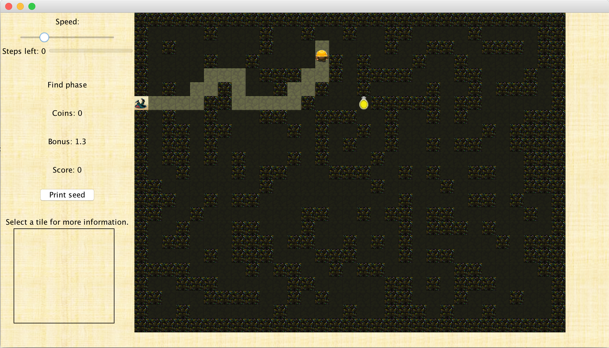

# NYSewerSystem
## Overview
A diver is going into a sewer system to find a lost ring. We want the diver to find the ring as quickly as possible. Once the ring is found, the diver heads to the exit. On the way out he sees coins all over the sewer system, and he wants to pick up as
many coins as possible.

All classes in packages src --> game/gui were given and provide the framework for this project (sewer system layout, coins, diver specification, etc..) 

Classes in package src --> student were created by me to find the ring and to get out within a certain
number of steps, picking up as many coins as possible.

## Find the Ring Phase 
On the way to the ring, the layout of the sewer system is unknown. The diver knows only the status of the place on which he is standing and the immediately neighboring ones. The goal is to make it to the ring in as few steps as possible. This does not have to be a completely blind search. The diver can see the ring shining in the distance. The closer the diver gets, the stronger the light from the ring. When standing on the ring, the distance is 0. Wherever the diver is, he will be able to see which neighbor is closer or farther from the ring.

Given these specifications from the given classes, I wrote the solution to this phase in method findRing(...) in class DiverMax within package student.

## Get Out Phase
After picking up the ring, the diver sees piles of coins all over the place. Luckily, underneath the ring is a map that reveals the full sewer system. The diver rushes around, picking up as many coins as possible. But because the sewer system is a rather unhealthy environment, he must get to the exit within a prescribed number of steps. The goal of the get-out phase is to get to the exit within a prescribed number of steps while collecting as many coins as possible. The total score is the product of these two quantities:
1. The value of the coins that the diver picks up during the get-out phase.
2. The score multiplier from the find-the-ring phase.

I wrote my solution to this part in function getOut() in class DiverMax in package student.
